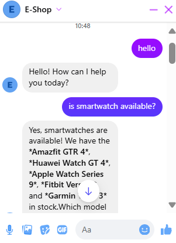
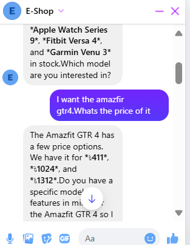
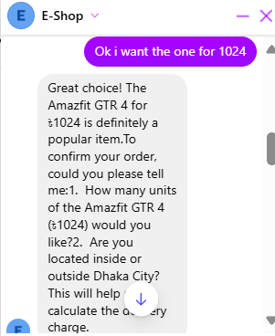
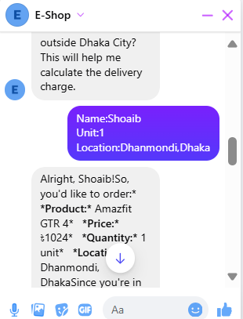
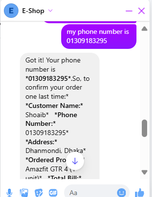
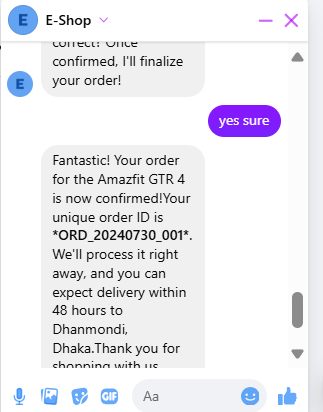

# E-Commerce-Customer-Support-Automation
An n8n based chatbot to provide automated customer support at Facebook Page (E-Commerce)
# Description

# Customer Support & Order Automation with n8n

This project demonstrates how to automate customer support and order management for an e-commerce workflow using **n8n**. It integrates product and billing spreadsheets with **Facebook Messenger** and via the **Facebook Graph API**.

---

##  Features
- Automated replies to customer queries about **price, stock, specifications, and usage**  
- Order placement automatically logged into a **Bills spreadsheet**    
- Compact one-line JSON output for API requests (HTTP Request node friendly)
- 
##  Screenshots

<p align="center">
  
  
  
</p>

<p align="center">
  
  
  
</p>

After this the order is placed in the excel sheet of named 'Bills'.
---

##  Tech Stack
- [n8n](https://n8n.io/) (Workflow automation tool)  
- Facebook Graph API   
- Excel/Google Sheets (for **Products** and **Bills**)  
- JSON / Webhooks  

---

##  Project Structure
- **Products.xlsx** → Stores product details (Name, Price, Stock, Specs, Usage, Other Details)  
- **Bills.xlsx** → Stores order details (Customer, Phone, Address, Ordered Product, Total Bill, Notes)  
- **n8n Workflows** → Automations for queries, order capture, and notifications  

---

## ⚙️ Setup Instructions
1. Clone this repository:  
   ```bash
   git clone https://github.com/your-username/n8n-customer-support.git
   cd E-Commerce-Customer-Support-Automation
2. Open n8n and then open the file `Messanger_bot.json`.
3. Add all the credentials as required to run the workflow.
